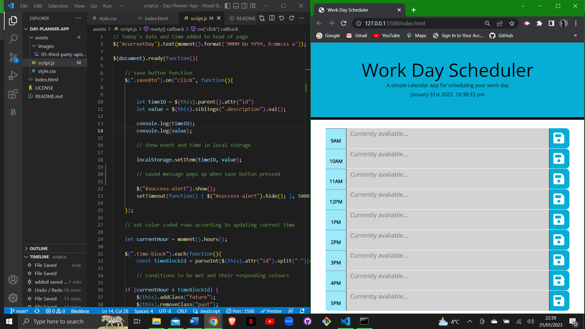
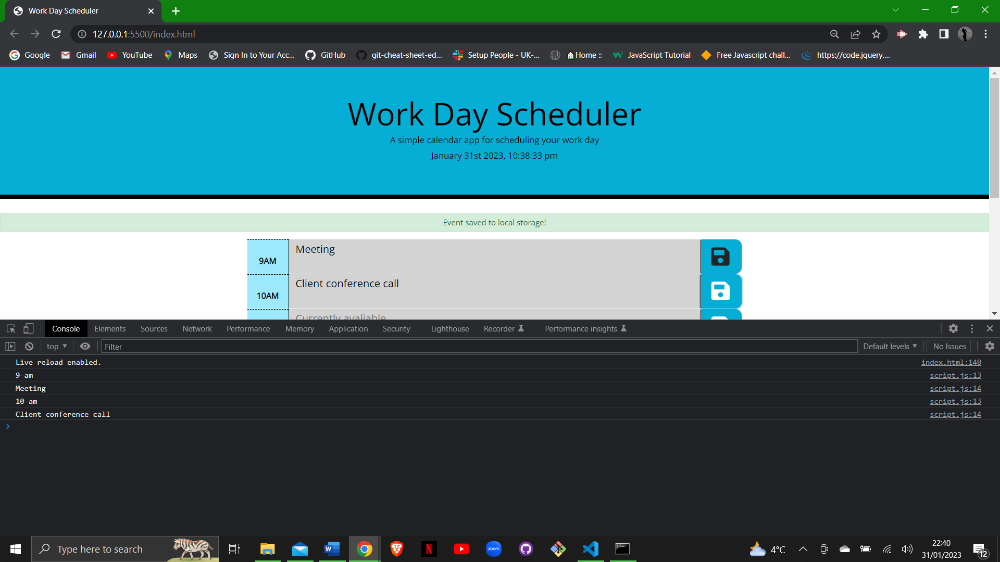

# Day-Planner-App

## User Story

AS a proffesional in a work place I want a work-day planner that I can schedule in appointments by the hour throughout the day sand save them to local storage. With this app I want to organise my day and keep track of the time and events throughout the day.

## Description 

In this project I have used HTML, CSS, JavaScript, JQuery and Moment.js to create a work-day planner app for keeping track of busy work schedules. The planner contains the following componants:

* A header with the current date and time.
* A table with a row representing each hour of the work day.
* A textbox for the user to type the name of their event.
* A save button for each hour that when clicked, saves the event to local storage, along with the correct time of appointment.
* A time tracker that colour-coordinates throughout the day to show when the hours and events are in the past, present or future. (grey; past, red; current, green; future).

## Deployed Link:

## Usage 

### License 

Licensed under the MIT license.

A calendar application that allows user to save events for each hour of the day.
